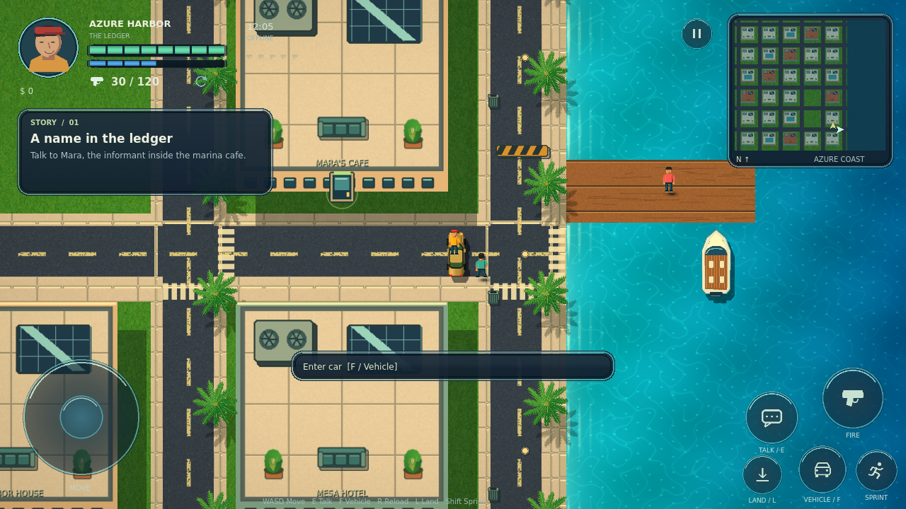
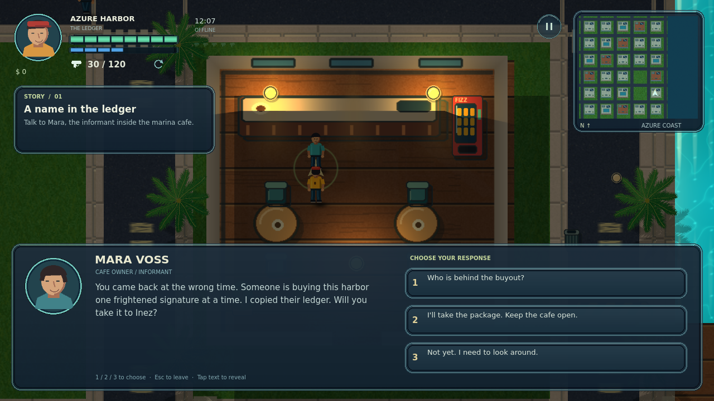

# Azure Harbor — native Android + shared Godot preview

An original, stylized 2D coastal open-city **development build**, made with **Godot 4.5.1**. Android is a native, offline game—not a WebView. The browser preview is a separate WebAssembly export of the **same Godot scene, GDScript, assets and shaders**; there is no second JavaScript gameplay implementation.

## Verified test build — 0.4.0

[**Download APK + AAB + rendered screenshots (ZIP)**](https://github.com/sami3463367/GTA/actions/runs/34190325189/artifacts/10042035985)

[Successful verification run](https://github.com/sami3463367/GTA/actions/runs/34190325189) · game source `50b1482`.

Extract and install `azure-harbor-test.apk` on Android 10+. The AAB is a **debug-signed packaging test, not a Play Store release**. GitHub may require sign-in; artifacts expire. Test signing keys change between builds, so installing a newer APK may require uninstalling the old one, which clears local saves.

**Verification:** 135 native regression checks; native scene captures; actual WebAssembly boot/input and browser-console smoke checks; successful APK/AAB exports; APK signature, minimum SDK 29, native engine libraries, and absence of internet/network-state permissions. These checks do not substitute for physical Android device, performance, thermal, accessibility or lifecycle testing.

## Play the browser preview

```sh
python3 scripts/serve_preview.py --port 8080
```

Open the server's browser URL (or the Arena live-preview panel). The server binds to `0.0.0.0`; no client-side localhost service is required. First load downloads approximately 39 MB of engine/game resources. Choose **Enter Azure Harbor**. Landscape orientation is recommended.

`preview/` contains the CI-built export, not a mockup. Changes to GDScript require a fresh Godot export; editing source does not hot-reload the running WebAssembly game. The browser uses its own local storage and does not share Android saves. The Android package needs no web server, account or connection.



## Gameplay and visual overhaul

- **Story and conversations:** Mara, Inez and Rafe have nearby Talk prompts, illustrated portraits, typewriter dialogue and selectable responses. Six objectives lead through a ledger delivery, hotel contact, helicopter rooftop landing, an evidence-delivery choice and a speedboat escape, then free roam. Choices persist and affect dialogue; this is one short chapter, not a large branching campaign.
- **Quest guidance:** current-objective card, world marker, off-screen directional arrow and map objective/player/hostile markers.
- **Roof concealment:** all 28 roofs start opaque. Entering an accessible building's door fades only that roof over 0.46 seconds. Its floor, props and characters become visible only for the selected room; leaving restores the roof and hides the room again. Rooftop landing does not open the interior.
- **Three furnished interiors:** café, Palm Market and Meridian Hotel. Textured floor TileMaps, wall borders/dividers, counters, furniture, rugs, plants, fixtures, window shafts and collision layouts. Vending machines sell a health-restoring drink for $15 when health is below full.
- **Custom mobile HUD:** circular illustrated avatar, textured segmented health/armor, delayed health-drop animation, damage vignette, ammo/reload slot, dark radar, skinned dialogue/menu/quest panels, glowing joystick and distinct fire/talk/vehicle/sprint/landing icons. Independent movement and fire touches.
- **Textured exteriors:** asphalt, road paint, crosswalks, curb/paving and grass tiles; opaque concrete/terracotta roofs, HVAC, solar panels, helipad and rooftop furnishings; palms, lamps, bins, barriers and bus stops. Animated shoreline water and world-only grading.
- **Native lighting and effects:** actual `CanvasModulate`, `PointLight2D` and `LightOccluder2D` nodes, day/night cycle, street lights, vehicle headlights, warm interior lights, wall/furniture shadows and muzzle light. Sprite/contact shadows, skids, exhaust, splashes, muzzle/damage particles, adaptive zoom and camera shake.
- **Movement and AI:** sidewalk AStar routes, lane-waypoint traffic, civilian fleeing, hostile chase/line-of-sight/cover behavior; guns, armor, ammunition and reloads. Cars, speedboat and helicopter with entry/exit transitions, safe disembark rules, hotel rooftop landing and lift.
- **Offline saves:** atomic JSON writes, corrupt-data rejection, migration of older chapter progress, saved story/choice flags, money, health/armor, ammunition and settings. Reload restores safe ground on foot; vehicle positions reset.



[Closed roof](docs/screenshots/native-roof-closed.png) · [Inside](docs/screenshots/native-interior.png) · [Roof restored after exit](docs/screenshots/native-roof-restored.png) · [Night lighting](docs/screenshots/native-night.png) · [Rooftop](docs/screenshots/native-rooftop.png)

These are actual engine renders, not concept art or physical Android screenshots. The art direction remains stylized 2D, not photorealistic 3D or ray tracing. Only three buildings are enterable. Traffic/hostile AI is a lightweight simulation, not a full city life system; there is no multiplayer, broad inventory economy or full-length campaign. No claim of zero bugs or store readiness is made.

## Controls

| Action | Touch | Keyboard |
|---|---|---|
| Move / steer | Left joystick | WASD / arrows |
| Talk / door / interact | Speech-bubble icon | E |
| Enter / exit vehicle | Vehicle icon | F |
| Helicopter landing / takeoff; hotel lift | Landing icon | L |
| Fire forward | Hold gun icon | Space |
| Reload | Tap ammo slot | R |
| Sprint | Sprint toggle | Shift |
| Dialogue choices | Tap response | 1 / 2 / 3 |
| Close dialogue / pause | Dialogue response / pause icon / Android Back | Escape |

Approach the café door near the starting car, enter and talk to Mara. Accept a response to advance the quest—walking into a room no longer completes it automatically. The helicopter is in Sunset Park; landing is allowed at the park pad or Meridian Hotel roof. Use the roof lift to return to the street. The marina boat can only be exited near safe shore/dock access, not in open water.

## Develop and test

Import `game/project.godot` in Godot **4.5.1 stable**, standard edition, then run the project. The pause menu offers High/Lite graphics and sound settings. Lite reduces shadow and post-processing work; real-phone frame rates still need measurement.

```sh
python3 scripts/check_art_standard.py
godot --headless --path game --editor --import
godot --headless --path game --script res://tests/test_game.gd
# Requires a graphics/display context, or Xvfb on Linux:
godot --path game --script res://tests/capture.gd
# Export templates must be installed:
godot --headless --path game --export-release "Web Preview" ../preview/index.html
```

The regression suite covers roofs/hidden rooms, dialogue branches and the complete story/rewards, collision, lights and TileMaps, vehicles/unsafe exits/rooftops, combat/armor/ammo, traffic/hostile states, save/load/corruption, settings and independent touch input. These are direct system tests, not a human touchscreen playthrough. The capture script restores an existing save after normal completion; back up important profiles before running developer tools.

The workflow renders ten native scenarios, exports the browser version, exercises it in Chromium, then exports and verifies Android packages. It publishes the checked browser export and selected screenshots to this session branch only when the build succeeds. Art-standards checks are a baseline lint gate, not a replacement for visual review. See [mandatory visual and interaction standards](docs/DESIGN_STANDARD.md).

## Assets and source

70 bundled authored PNG textures/sprites/UI skins, including the original surface and actor kit. Regenerate using a Python environment with `tools/requirements-art.txt`: run `tools/generate_art.py`, then `tools/generate_polish.py`. The latter also generates the explicit export-safe texture registry. Python is not needed to build or play the game.

- `game/scripts/city_game.gd`: gameplay, transitions, combat and persistence.
- `world_data.gd`, `interior_data.gd`: city geometry and authored room layouts.
- `narrative.gd`, `city_navigation.gd`: quests/dialogue and routing/cover.
- `city_renderer.gd`, `game/shaders/`: TileMaps, sprites, roofs, native lights and effects.
- `game_hud.gd`: custom textured UI and touch handling.
- `game/tests/`: regression tests and native render captures.
- `game/web_shell.html`: branded loading shell around the exported Godot canvas.
- `scripts/serve_preview.py`, `scripts/browser_smoke.cjs`: preview hosting and browser checks.
- `.github/workflows/android.yml`: shared-project test/export pipeline.

Map, story, character names, sprite/texture art and sounds are original project material. No GTA characters, maps, music or extracted assets are used. Bundled DejaVu fonts retain their license in `game/assets/fonts/LICENSE.txt`; Godot/component notices are in `game/assets/GODOT_LICENSE.txt` and `GODOT_COPYRIGHT.txt`.

## Android and Play release requirements

- Native Android 10+ (minimum SDK 29), target SDK 35; check current Play requirements before submission.
- ARMv7, ARM64 and x86_64; landscape; Compatibility renderer.
- APK: installable test build. AAB: packaging test, not directly installable and not production-signed.
- No accounts, ads, analytics, remote asset downloads or Android internet permissions.

For production signing, configure GitHub repository secrets `ANDROID_KEYSTORE_BASE64`, `ANDROID_KEY_ALIAS` and `ANDROID_KEYSTORE_PASSWORD` securely in GitHub—not in chat or tracked files. The workflow's `release = true` path requires these secrets and fails rather than silently substituting a debug key. Preserve the upload key for future updates.

Before publishing, complete gameplay/device QA (including airplane mode, interruptions, aspect ratios and 16 KB page-size devices), performance testing, current target-API compliance, permanent package identity, signing, original store artwork, privacy/data-safety declarations, content rating and Play testing/review. A successful test export does not establish Play Store readiness.
